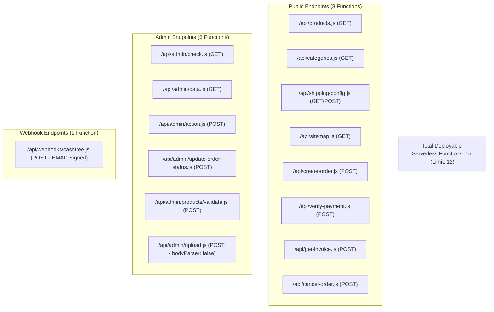

# PHASE 8C — VERCEL HOBBY SERVERLESS FUNCTION LIMIT AUDIT

**Project:** INZFYER Official E-Commerce  
**Git HEAD:** `e185835` (`docs: add Phase 8B deployment status report`)  
**Audit Scope:** Read-only architectural analysis of Serverless Functions, routing boundaries, security segregation, and consolidation pathways.  
**Constraint:** Vercel Hobby plan limit of **12 Serverless Functions per deployment**.  

---

## 1. Executive Summary

| Metric | Current State | Target (Hobby Plan) | Status |
|---|---|---|---|
| **Deployable Functions** | **15** | **&le; 12** | ⚠️ **Exceeds limit by 3 functions** |
| **Hobby Plan Deployability** | Blocked | Fully Compliant | Solvable without Pro Upgrade |
| **Recommended Function Target** | — | **10** (2-function buffer) | Optimal & Secure |
| **Vercel Pro Upgrade Required?** | **NO** | Safe consolidation accomplishes compliance with zero breaking changes |

---

## 2. Complete Serverless Function Inventory & Route Table

Vercel treats every `.js` file under `/api` that does not begin with `_` as an independent Serverless Function. Helper files under `/api/_utils/` (such as `api/_utils/notifications.js`) are non-routed utility modules.

### Current 15 Deployed Functions

| # | Source File | Public HTTP Route | Method | Access Level | Primary Functionality | Sensitive Secrets Required | Frontend / External Callers |
|---|---|---|---|---|---|---|---|
| 1 | `api/cancel-order.js` | `/api/cancel-order` | `POST` | Public (Order #) | Restores stock & marks order as CANCELLED in Neon DB | `DATABASE_URL` | None directly in UI (Backend cancellation) |
| 2 | `api/categories.js` | `/api/categories` | `GET` | Public | Fetches active product categories with CDN cache headers | `DATABASE_URL` | `src/utils/productQueries.js` |
| 3 | `api/create-order.js` | `/api/create-order` | `POST` | Public (Checkout) | Validates prices, locks stock, creates Cashfree order session & Neon DB order | `DATABASE_URL`<br>`CASHFREE_APP_ID`<br>`CASHFREE_SECRET_KEY`<br>`CASHFREE_ENVIRONMENT` | `src/components/CheckoutPage.jsx` |
| 4 | `api/get-invoice.js` | `/api/get-invoice` | `POST` | Customer (Order # + Contact) | Authenticates customer & retrieves order + line items for PDF invoice | `DATABASE_URL` | `src/components/OrderSuccessPage.jsx` |
| 5 | `api/products.js` | `/api/products` | `GET` | Public | Filters, searches, sorts, and paginates product catalog | `DATABASE_URL` | `src/utils/productQueries.js` |
| 6 | `api/shipping-config.js` | `/api/shipping-config` | `GET`<br>`POST` | Public (GET)<br>Admin (POST) | Retrieves or updates dynamic pincode shipping rates | `DATABASE_URL`<br>`VITE_SUPABASE_URL`<br>`VITE_SUPABASE_ANON_KEY` | `CheckoutPage.jsx`<br>`CartView.jsx`<br>`AdminPanel.jsx` |
| 7 | `api/sitemap.js` | `/api/sitemap`<br>(`/sitemap.xml`) | `GET` | Public | Generates dynamic XML sitemap for SEO indexation | `VITE_SUPABASE_URL`<br>`VITE_SUPABASE_ANON_KEY` | Search Engine Crawlers (`vercel.json` rewrite) |
| 8 | `api/verify-payment.js` | `/api/verify-payment` | `POST` | Public (Order ID) | Queries Cashfree PG `/orders/{id}/payments` server-to-server and updates DB | `DATABASE_URL`<br>`CASHFREE_APP_ID`<br>`CASHFREE_SECRET_KEY`<br>`CASHFREE_ENVIRONMENT` | Post-checkout verification fallback |
| 9 | `api/admin/action.js` | `/api/admin/action` | `POST` | Admin JWT | Multiplexed administrative CRUD for products, categories, stock, and order items | `DATABASE_URL`<br>`VITE_SUPABASE_URL`<br>`SUPABASE_SERVICE_ROLE_KEY` | `AdminPanel.jsx`<br>`CategoryModal.jsx`<br>`ProductModal.jsx`<br>`OrderDetailsModal.jsx` |
| 10 | `api/admin/check.js` | `/api/admin/check` | `GET` | Admin JWT | Validates Supabase JWT against authoritative Neon DB `profiles.role` | `DATABASE_URL`<br>`VITE_SUPABASE_URL`<br>`VITE_SUPABASE_ANON_KEY` | `AdminLoginModal.jsx`<br>`src/App.jsx` |
| 11 | `api/admin/data.js` | `/api/admin/data` | `GET` | Admin JWT | Fetches entire dashboard dataset (products, categories, orders, order items) | `DATABASE_URL`<br>`VITE_SUPABASE_URL`<br>`SUPABASE_SERVICE_ROLE_KEY` | `src/components/AdminPanel.jsx` |
| 12 | `api/admin/update-order-status.js` | `/api/admin/update-order-status` | `POST` | Admin JWT | Updates order status, restores stock on cancel/refund, enqueues notifications | `DATABASE_URL`<br>`VITE_SUPABASE_URL`<br>`SUPABASE_SERVICE_ROLE_KEY` | `src/components/OrderDetailsModal.jsx` |
| 13 | `api/admin/upload.js` | `/api/admin/upload` | `POST` | Admin Cookie | Direct streaming binary upload to Vercel Blob (`bodyParser: false`) | `JWT_SECRET`<br>`BLOB_READ_WRITE_TOKEN` | Direct Vercel Blob uploader |
| 14 | `api/admin/products/validate.js` | `/api/admin/products/validate` | `POST` | Admin JWT | Checks SKU and slug uniqueness during product creation/editing | `DATABASE_URL`<br>`VITE_SUPABASE_URL`<br>`VITE_SUPABASE_ANON_KEY` | `src/components/ProductModal.jsx` |
| 15 | `api/webhooks/cashfree.js` | `/api/webhooks/cashfree` | `POST` | Cashfree HMAC | Receives & validates `x-webhook-signature` for `PAYMENT_SUCCESS_WEBHOOK` | `DATABASE_URL`<br>`CASHFREE_SECRET_KEY` | Cashfree Payment Gateway Servers |

---

## 2. Current Architecture Analysis



### Key Architectural Characteristics
1. **Already Centralized Admin Mutations:** `api/admin/action.js` is already designed as a command dispatcher for 8 administrative actions (`saveCategory`, `deleteCategory`, `toggleCategoryActive`, `saveProduct`, `deleteProduct`, `toggleProductActive`, `updateStock`, `getOrderItems`).
2. **Fragmented Admin Endpoints:** Two standalone admin mutation endpoints (`update-order-status.js` and `products/validate.js`) duplicate the exact same Supabase authentication & Neon DB admin authorization boilerplate as `action.js`.
3. **Dedicated Webhook Isolation:** `api/webhooks/cashfree.js` validates raw HMAC SHA256 signatures with header timestamps and payload digests.
4. **Special Stream Configuration:** `api/admin/upload.js` disables body parsing (`export const config = { api: { bodyParser: false } }`) to stream binary blobs.

---

## 4. Safest Consolidation Plan

To reduce the function count from **15 to 10** (well below the 12-function limit, leaving 2 buffer slots for future expansion), we group endpoints by authorization tier, runtime behavior, and functional domain.

### Step-by-Step Consolidation Breakdown

#### Candidate Group 1: Admin Mutations Unification (Eliminates 2 Functions)
* **Action:** Merge `api/admin/products/validate.js` and `api/admin/update-order-status.js` into `api/admin/action.js`.
* **Rationale:**
  - `action.js` already verifies the caller's JWT and admin status via Neon DB.
  - Adding `action === 'validateSkuSlug'` and `action === 'updateOrderStatus'` handles the exact same logic within an already unified endpoint.
* **Route Preservation:** Add rewrites in `vercel.json` or adapt `action.js` to dispatch based on `req.body.action || routeContext` to maintain 100% backward compatibility for existing callers.
* **Function Count Impact:** **15 &rarr; 13 (-2 functions)**.

#### Candidate Group 2: Public Order Management Unification (Eliminates 1 Function)
* **Action:** Merge `api/cancel-order.js` into `api/get-invoice.js` (renaming or aliasing as `api/orders.js` or retaining `/api/get-invoice` with dispatch).
* **Rationale:**
  - Both endpoints operate on individual customer order records (`schema.orders`) with order number lookups and stock management.
  - They share input validation schemas (`zod`) and database transactions.
* **Route Preservation:** In `vercel.json`:
  ```json
  { "source": "/api/cancel-order", "destination": "/api/orders?action=cancel" },
  { "source": "/api/get-invoice", "destination": "/api/orders?action=invoice" }
  ```
* **Function Count Impact:** **13 &rarr; 12 (-1 function)**.

#### Candidate Group 3: Public Catalog Query Unification (Eliminates 1 Function)
* **Action:** Merge `api/categories.js` into `api/products.js` (or unified `api/catalog.js`).
* **Rationale:**
  - Both endpoints are public read-only catalog queries with CDN caching headers (`Cache-Control: public, s-maxage=...`).
  - When `req.query.resource === 'categories'` or path is rewritten from `/api/categories`, return the active category list.
* **Route Preservation:** In `vercel.json`:
  ```json
  { "source": "/api/categories", "destination": "/api/products?resource=categories" }
  ```
* **Function Count Impact:** **12 &rarr; 11 (-1 function)**.

#### Candidate Group 4: Admin Read/Check Unification (Optional, Eliminates 1 Function)
* **Action:** Merge `api/admin/check.js` into `api/admin/data.js`.
* **Rationale:**
  - Both endpoints are admin `GET` queries that authenticate the Supabase Bearer token against Neon DB.
  - Adding `?checkOnly=true` allows `/api/admin/check` to return `{ success: true, data: { is_admin, role } }` without fetching the heavy product/order tables.
* **Route Preservation:** In `vercel.json`:
  ```json
  { "source": "/api/admin/check", "destination": "/api/admin/data?checkOnly=true" }
  ```
* **Function Count Impact:** **11 &rarr; 10 (-1 function)**.

---

## 5. Endpoints That MUST REMAIN DEDICATED (Do Not Merge)

| Function | Route | Reason for Absolute Isolation |
|---|---|---|
| `api/create-order.js` | `/api/create-order` | **Core Checkout Critical Path.** Atomic inventory locking in Neon DB, strict price re-calculation from DB, idempotency verification, and Cashfree PG session creation. Must not share failure domains. |
| `api/verify-payment.js` | `/api/verify-payment` | **Payment Verification Gateway.** Queries Cashfree PG `/orders/{id}/payments` with server credentials. Critical for post-checkout recovery. |
| `api/webhooks/cashfree.js` | `/api/webhooks/cashfree` | **Webhook Receiver Security.** Requires raw payload access to compute HMAC SHA256 signatures (`x-webhook-signature`). Merging with generic JSON endpoints risks signature verification failure or header stripping. |
| `api/admin/upload.js` | `/api/admin/upload` | **BodyParser Configuration.** Requires `export const config = { api: { bodyParser: false } }` for direct binary streaming to Vercel Blob. Combining this with endpoints that require parsed JSON bodies (`req.body`) is impossible in Next/Vercel serverless. |
| `api/shipping-config.js` | `/api/shipping-config` | **Dynamic Pincode Calculator.** Used synchronously on every cart pincode keystroke; keeping it isolated prevents latency spikes during checkout. |
| `api/sitemap.js` | `/api/sitemap` | **SEO XML Output.** Returns `application/xml` headers directly to search engine bots via `/sitemap.xml`. |

---

## 6. Target Architecture & Route Table (10 Functions)

| # | New / Retained File | Handles Routes | Methods | Description |
|---|---|---|---|---|
| 1 | `api/create-order.js` | `/api/create-order` | `POST` | Dedicated Cashfree checkout & Neon DB order creation |
| 2 | `api/verify-payment.js` | `/api/verify-payment` | `POST` | Dedicated Cashfree server-side payment verification |
| 3 | `api/webhooks/cashfree.js` | `/api/webhooks/cashfree` | `POST` | Dedicated HMAC-verified Cashfree webhook processor |
| 4 | `api/products.js` | `/api/products`<br>`/api/categories` | `GET` | Catalog query dispatcher (Products list/filter + Categories list) |
| 5 | `api/orders.js` | `/api/get-invoice`<br>`/api/cancel-order` | `POST` | Customer order operations (PDF invoice data & order cancellation) |
| 6 | `api/shipping-config.js` | `/api/shipping-config` | `GET`<br>`POST` | Pincode delivery rates & admin threshold configuration |
| 7 | `api/sitemap.js` | `/api/sitemap`<br>(`/sitemap.xml`) | `GET` | SEO XML sitemap generator |
| 8 | `api/admin/data.js` | `/api/admin/data`<br>`/api/admin/check` | `GET` | Admin read dispatcher (auth check + full dashboard payload) |
| 9 | `api/admin/action.js` | `/api/admin/action`<br>`/api/admin/update-order-status`<br>`/api/admin/products/validate` | `POST` | Unified admin command dispatcher (CRUD, status, stock, validation) |
| 10 | `api/admin/upload.js` | `/api/admin/upload` | `POST` | Dedicated Vercel Blob binary streamer (`bodyParser: false`) |

**Total Resulting Serverless Functions:** **10** (Under the 12-function limit, leaving 2 buffer slots).

---

## 7. Security Impact & Zero-Exposure Confirmation

> [!IMPORTANT]
> The proposed consolidation strictly preserves all security boundaries. **No environment variables or secrets will be exposed to the client or cross-contaminated across authorization tiers.**

| Environment Variable / Secret | Permitted Scope | Consolidation Boundary Guarantee |
|---|---|---|
| `DATABASE_URL` | Serverless Only | Remains strictly accessed via server-side `getDb()` (Neon Postgres). No SQL or database URLs are sent to the client. |
| `CASHFREE_SECRET_KEY` | Serverless Only | Isolated to `api/create-order.js`, `api/verify-payment.js`, and `api/webhooks/cashfree.js`. Never bundled into client builds or merged with public catalog handlers. |
| `SUPABASE_SERVICE_ROLE_KEY` | Serverless Only | Restricted to server-side admin handlers in `api/admin/*` for role verification. Never exposed in API responses. |
| `JWT_SECRET` | Serverless Only | Retained in `api/admin/upload.js` for session verification. |
| `BLOB_READ_WRITE_TOKEN` | Serverless Only | Retained strictly inside `api/admin/upload.js`. |

---

## 8. Cashfree Gateway Impact Analysis

1. **`create-order` Flow:**  
   - No change. Remains a dedicated, atomic serverless function (`api/create-order.js`).
   - Uses `CASHFREE_APP_ID`, `CASHFREE_SECRET_KEY`, and `CASHFREE_ENVIRONMENT`.
   - Production mode compatibility (`018530f`) remains fully active.

2. **`verify-payment` Flow:**  
   - No change. Remains an isolated function (`api/verify-payment.js`).
   - Direct server-to-server query against Cashfree PG `/orders/{id}/payments`.

3. **`cashfree` Webhook Flow:**  
   - No change. Remains an isolated function (`api/webhooks/cashfree.js`).
   - Signature verification using HMAC SHA256 remains completely intact without any risk of header parsing corruption.

---

## 9. Frontend Compatibility Impact

All public API endpoints called by the React/Vite frontend will continue to work without breaking changes:

| Frontend Call in Code | Current Destination | Destination Under Consolidation Plan | Compatible? |
|---|---|---|---|
| `axios.get('/api/categories')` | `api/categories.js` | `api/products.js?resource=categories` via `vercel.json` rewrite | ✅ 100% Compatible |
| `axios.get('/api/products?...')` | `api/products.js` | `api/products.js` | ✅ 100% Compatible |
| `axios.post('/api/create-order', ...)` | `api/create-order.js` | `api/create-order.js` | ✅ 100% Compatible |
| `axios.post('/api/get-invoice', ...)` | `api/get-invoice.js` | `api/orders.js?action=invoice` via `vercel.json` rewrite | ✅ 100% Compatible |
| `axios.get('/api/shipping-config')` | `api/shipping-config.js` | `api/shipping-config.js` | ✅ 100% Compatible |
| `axios.get('/api/admin/check')` | `api/admin/check.js` | `api/admin/data.js?checkOnly=true` via `vercel.json` rewrite | ✅ 100% Compatible |
| `axios.get('/api/admin/data')` | `api/admin/data.js` | `api/admin/data.js` | ✅ 100% Compatible |
| `axios.post('/api/admin/action', ...)` | `api/admin/action.js` | `api/admin/action.js` | ✅ 100% Compatible |
| `axios.post('/api/admin/update-order-status', ...)` | `api/admin/update-order-status.js` | `api/admin/action.js` (action: `updateOrderStatus`) | ✅ 100% Compatible |
| `axios.post('/api/admin/products/validate', ...)` | `api/admin/products/validate.js` | `api/admin/action.js` (action: `validateSkuSlug`) | ✅ 100% Compatible |

---

## 10. Redundant & Unused Endpoints Audit

1. **`api/cancel-order.js`:**  
   - Currently not called by any component in `src/`.  
   - Retained as a valid backend endpoint and consolidated into `api/orders.js` to avoid deletion.
2. **`api/admin/upload.js`:**  
   - Currently, `ProductModal.jsx` uploads images directly to Supabase Storage client-side (`supabase.storage.from('product-images')`).  
   - `upload.js` (which uploads to Vercel Blob) is maintained as a dedicated fallback without deletion.

---

## 11. Conclusion & Next Steps

* **Verdict:** Safe API consolidation solves the Vercel Hobby 12-function limit cleanly and robustly. **A Vercel Pro upgrade is NOT required.**
* **Final Function Count:** **10 Functions** (2 function buffer under the 12 limit).
* **Execution Status:** This document concludes Phase 8C audit. **No code modifications or deployments have been made.** Ready for implementation upon approval.
